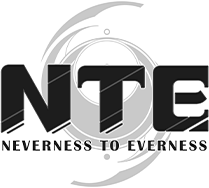

<div align="center">
  
  <p style="font-size: 40px; font-weight: 800; letter-spacing: 1px; margin: 10px 0 4px;">Awesome 异环</p>
  <p style="color:#59636e; margin: 0 0 16px;">社区开源项目索引 · Community Open-Source Index</p>
</div>

<p align="center">
  <a href="https://github.com/sindresorhus/awesome"></a>
  <a href="LICENSE"></a>
  26<!-- PROJECTS_COUNT_END -->-blue?label=Projects" alt="Projects">
</p>

<p align="center">
  <a href="./README.md">简体中文</a> ·
  English
</p>

> A curated index of third-party **open-source** projects for *Neverness to Everness* (NTE), covering automation, calculators, data analytics, asset mining, mods, performance tuning and tools.

Full list: **[LIST.en.md](./LIST.en.md)** · Chinese: **[LIST.md](./LIST.md)**.

## Contents

- [List](#list)
- [Inclusion criteria](#inclusion-criteria)
- [Contributing](#contributing)
- [Development](#development)
- [Roadmap](#roadmap)
- [Disclaimer](#disclaimer)

## List

See **[LIST.en.md](./LIST.en.md)**.

> Generated from `data/projects.json`; do not edit the LIST files directly.

## Inclusion criteria

This project curates **valuable** open-source projects related to Neverness to Everness:

- **Open source**: readable source must be public; binary-only distributions are not accepted.
- **Relevant**: NTE-specific, or a multi-game tool that explicitly supports NTE.
- **Usable**: has a README that explains purpose and usage; placeholder repos are rejected.
- **Compliant**: must not modify the game process, memory or network. **Rule = injection.** Screen-reading + simulated input (e.g. MaaNTE, ok-nte) is in scope; cheats, memory injection, ESP, teleport, speed hacks and private servers are rejected.

Lists are also **de-duplicated** per functional area: only one representative project per area unless an alternative offers clear differentiation.

**Ranking**: feature coverage > activity & documentation > cross-platform / cross-game support > stars.

## Contributing

Open-source your project, or found a missing one? Issues and PRs are welcome. See [CONTRIBUTING.md](./CONTRIBUTING.en.md) for details.

## Development

```bash
bun install        # install deps
bun run check      # validate data/projects.json
bun run generate   # generate LIST.md / LIST.en.md from data
bun run stars      # snapshot star counts to data/stars.json
bun run add        # interactive add
```

CI validates data and keeps generated files fresh on every PR; `stars` runs daily; `links` checks for dead links weekly.

## Roadmap

- [ ] Richer project metadata (star sorting, maintenance filters, language/platform dimensions).
- [ ] A friendlier data view (site / interactive).
- [ ] Continued i18n refinement of zh & en descriptions.

## Disclaimer

- This is a **community-maintained third-party index**. It is not affiliated with or endorsed by the developers, publisher or any associated companies of *Neverness to Everness* (e.g. Hotta Studio / Perfect World).
- The list provides no guarantee of functionality, security, stability or legality. Inclusion is not an endorsement.
- Some projects (especially automation, bot and mod ones) may violate the game ToS or EULA and can lead to account restrictions or bans. Use at your own risk.
- All names, trademarks, artwork and game data of *Neverness to Everness* belong to their respective owners. This project is a non-commercial community index.
- If a rights holder believes any entry is inappropriate, contact us via [Issue](https://github.com/zzstar101/awesome-nte/issues) and we will remove it after verification.
